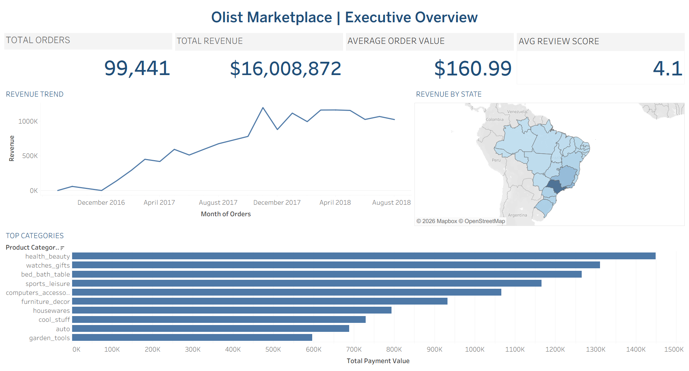
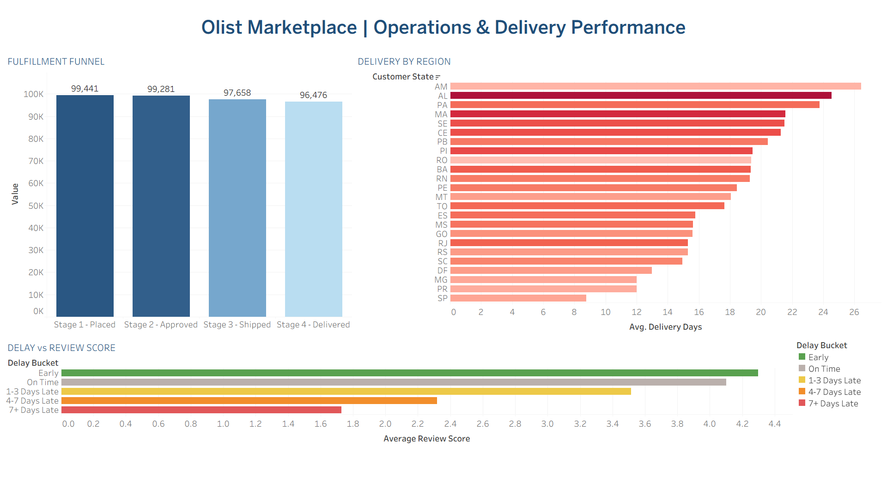
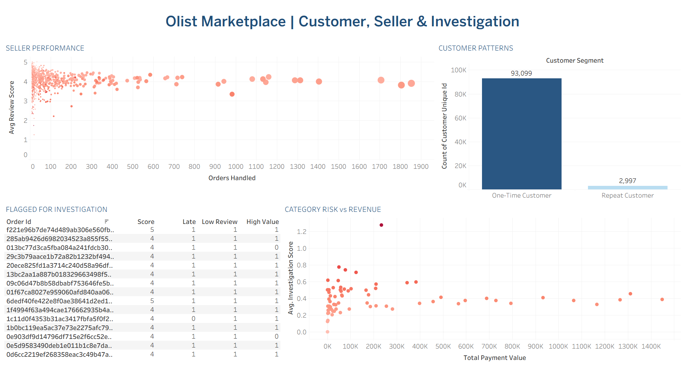

# 🛒 Olist Marketplace Operations & Performance Intelligence

Built as an end-to-end data analytics portfolio project, this project
analyzes the **Olist Brazilian e-commerce marketplace** to understand
marketplace operations, delivery performance, customer behavior, seller
performance, category risk, and orders requiring investigation.

The project transforms raw marketplace data into structured SQL analysis
and interactive Tableau dashboards to identify operational patterns and
business risks across the customer-to-delivery journey.

------------------------------------------------------------------------

## 📌 Analytics Workflow

**Raw Marketplace Data → Data Exploration → SQL Analysis → Tableau
Dashboards → Business Insights**

------------------------------------------------------------------------

## 🔗 Links

-   **LinkedIn:**
    https://www.linkedin.com/in/gurram-harshitha-939179277/
-   **GitHub Profile:** https://github.com/gurramharshitha7

------------------------------------------------------------------------

# 📌 Project Overview

An e-commerce marketplace involves multiple connected processes:

**Customer → Order → Seller → Payment → Delivery → Review**

Understanding these processes together is important because a successful
order is not only about generating revenue. Delivery delays, seller
performance, customer satisfaction, payment value, and product category
risk can all affect marketplace performance.

This project answers questions such as:

-   How is marketplace revenue distributed over time?
-   Which product categories generate the highest payment value?
-   How efficiently do orders move through the fulfillment process?
-   Which regions experience longer delivery times?
-   How does delivery delay relate to customer review scores?
-   Which sellers handle the highest order volumes?
-   How do customer purchasing patterns differ between one-time and
    repeat customers?
-   Which orders show multiple risk indicators and require
    investigation?

------------------------------------------------------------------------

# 🎯 Key Business Questions

## 1. Marketplace Performance

-   How many orders were placed?
-   What is the total payment value generated by the marketplace?
-   What is the average order value?
-   How does revenue change over time?
-   Which states contribute significantly to marketplace revenue?
-   Which product categories generate the highest payment value?

## 2. Operations & Delivery Performance

-   How efficiently do orders progress through the fulfillment funnel?
-   Where do order volumes decline between fulfillment stages?
-   Which customer regions experience the longest average delivery
    times?
-   How does delivery delay affect customer review scores?
-   Which delay buckets are associated with lower customer satisfaction?

## 3. Seller Performance

-   Which sellers handle the highest order volumes?
-   Which sellers contribute significantly to marketplace activity?
-   Are high-volume sellers associated with operational or delivery
    risks?
-   Which sellers may require closer performance monitoring?

## 4. Customer Patterns

-   How many customers are one-time versus repeat customers?
-   How concentrated is the customer base around one-time purchases?
-   What does customer purchasing behavior indicate about retention
    patterns?

## 5. Investigation & Risk

-   Which orders show multiple operational risk indicators?
-   Are there orders combining delivery delays and low review scores?
-   Which high-value orders also show customer or operational risk?
-   How can multiple indicators be combined into an investigation score?

------------------------------------------------------------------------

# 🛠 Tools & Technologies

  -----------------------------------------------------------------------
  Tool                                Usage
  ----------------------------------- -----------------------------------
  **SQL**                             Data exploration, joins,
                                      aggregations and analytical queries

  **PostgreSQL**                      Data storage and analysis

  **Tableau Public**                  Interactive dashboard development
                                      and visualization

  **Excel / CSV**                     Initial data exploration and
                                      dataset handling
  -----------------------------------------------------------------------

------------------------------------------------------------------------

# 📊 Dashboards

## 1. Executive Overview

The Executive Overview provides a high-level view of marketplace
performance.

### Key Metrics

-   **99,441 Total Orders**
-   **\$16,008,872 Total Revenue**
-   **\$160.99 Average Order Value**
-   **4.1 Average Review Score**

### Key Views

-   Revenue Trend
-   Revenue by State
-   Top Product Categories by Payment Value

The dashboard provides an executive-level view of overall marketplace
scale, revenue performance, geographic distribution, and the product
categories generating the highest payment value.



------------------------------------------------------------------------

## 2. Operations & Delivery Performance

This dashboard focuses on how efficiently orders move through the
marketplace fulfillment process and how delivery performance affects
customer satisfaction.

### Fulfillment Funnel

The fulfillment funnel tracks orders across four stages:

-   Stage 1 --- Placed
-   Stage 2 --- Approved
-   Stage 3 --- Shipped
-   Stage 4 --- Delivered

The funnel helps identify where order volumes decline during the
fulfillment lifecycle.

### Delivery by Region

Average delivery days are compared across customer states to identify
regions experiencing longer delivery times.

### Delay vs Review Score

Orders are grouped into delivery buckets:

-   Early
-   On Time
-   1--3 Days Late
-   4--7 Days Late
-   7+ Days Late

This analysis highlights how customer satisfaction changes as delivery
delays increase.



------------------------------------------------------------------------

## 3. Customer, Seller & Investigation Intelligence

This dashboard combines seller activity, customer purchasing behavior,
and operational risk indicators.

### Seller Performance

The seller performance view compares:

-   Orders handled
-   Average review score

This helps identify sellers with high marketplace activity while
providing additional context around customer satisfaction.

### Customer Patterns

Customers are segmented into:

-   **One-Time Customers**
-   **Repeat Customers**

The analysis shows that the marketplace is heavily dominated by one-time
customers, highlighting an opportunity to further investigate customer
retention and repeat purchasing behavior.

### Flagged for Investigation

Orders are evaluated using multiple indicators:

-   Late delivery
-   Low review score
-   High-value order

An **Investigation Score** combines these risk signals to identify
orders requiring closer analysis.

This approach demonstrates how multiple business indicators can be
combined instead of analyzing operational problems independently.

### Category Risk vs Revenue

Product categories are compared using:

-   Total Payment Value
-   Average Investigation Score

This helps identify categories that combine high marketplace value with
elevated operational or customer risk.



------------------------------------------------------------------------

# 🔍 Key Insights

## Marketplace Performance

-   The marketplace processed **99,441 orders**.
-   Total payment value reached approximately **\$16 million**.
-   The average order value was approximately **\$160.99**.
-   The overall average customer review score was **4.1**.

## Customer Behavior

The customer base is strongly concentrated around **one-time
customers**, while repeat customers represent a significantly smaller
segment.

This suggests that customer retention and repeat purchasing behavior
could be an important area for deeper business analysis.

## Delivery & Customer Satisfaction

Delivery performance is closely connected to customer experience.

By grouping orders into delivery delay buckets, the analysis allows
customer satisfaction to be compared across:

**Early → On Time → Moderately Late → Significantly Late**

This makes it easier to identify whether increasing delivery delays are
associated with declining review scores.

## Operational Risk

Rather than treating late delivery, low review scores, and high-value
orders as separate problems, the project combines them into an
**Investigation Score**.

This creates a more practical analytical approach for identifying orders
that deserve operational attention.

## Category Intelligence

The Category Risk vs Revenue analysis compares business value with
operational risk.

This helps avoid focusing only on categories generating high revenue and
instead considers whether those categories also show elevated
investigation scores.

------------------------------------------------------------------------

# 🧠 SQL Analysis

The SQL analysis was organized around major business areas.

## 1. Order & Operational Analysis

Analysis focused on:

-   Order lifecycle
-   Fulfillment stages
-   Delivery performance
-   Delay calculations
-   Operational trends

## 2. Customer Analysis

Analysis focused on:

-   Customer purchasing behavior
-   One-time versus repeat customers
-   Customer segmentation
-   Review patterns

## 3. Seller Performance & Risk

Analysis focused on:

-   Seller order volume
-   Seller performance
-   Review patterns
-   Operational risk indicators

## 4. Product Category Intelligence

Analysis focused on:

-   Category revenue
-   Payment value
-   Category-level risk
-   Revenue versus investigation patterns

------------------------------------------------------------------------

# 📐 Investigation Framework

One of the key analytical components of this project is the creation of
an **Investigation Score**.

Orders are evaluated based on multiple potential risk indicators:

  Indicator            Purpose
  -------------------- -----------------------------------------------
  Late Delivery Flag   Identifies delayed orders
  Low Review Flag      Identifies potential customer dissatisfaction
  High Value Flag      Identifies orders with higher business value

These indicators are combined to prioritize orders for investigation.

This demonstrates a more business-oriented approach than simply creating
individual charts for separate metrics.

------------------------------------------------------------------------

# 📁 Project Structure

``` text
Olist-Marketplace-Operations/
│
├── sql/
│   ├── 01_order_operational_analysis.sql
│   ├── 02_customer_analysis.sql
│   ├── 03_seller_performance_risk.sql
│   └── 04_product_category_intelligence.sql
│
├── notebooks/
│   └── Data preparation and investigation notebooks
│
├── dashboard/
│   └── Tableau workbook
│
├── images/
│   ├── 01_Executive_Overview.png
│   ├── 02_Operations_&_DeliveryPerformance.png
│   └── 03_Cutomer_Seller_Investigation.png
│
└── README.md
```

------------------------------------------------------------------------

# 🚀 How to Explore This Project

### 1. Start with the README

Review the business questions, methodology, dashboards, and key
insights.

### 2. Review the SQL Analysis

Open the SQL files to understand how the marketplace data was analyzed
across:

-   Operations
-   Customers
-   Sellers
-   Product categories

### 3. Explore the Tableau Dashboard

Open the Tableau workbook to interact with the dashboards and explore
marketplace performance.

------------------------------------------------------------------------

# 💡 What This Project Demonstrates

This project demonstrates the ability to:

-   Work with a real-world relational e-commerce dataset.
-   Analyze connected customer, seller, order, payment, review, and
    delivery data.
-   Write structured SQL analysis for multiple business domains.
-   Translate SQL analysis into business-focused metrics.
-   Build an investigation framework using multiple risk indicators.
-   Analyze delivery performance and customer satisfaction together.
-   Compare revenue with operational risk.
-   Build multi-dashboard Tableau reports.
-   Present analytical findings in a business-oriented format.

------------------------------------------------------------------------

# 👩‍💻 Author

**Harshitha Gurram**\
Aspiring Data Analyst \| SQL \| Python \| Tableau \| Excel

I come from a backend development background and am transitioning into
data analytics, with a focus on building end-to-end projects that
combine data analysis, SQL, visualization, and business-focused
insights.

-   **LinkedIn:**
    https://www.linkedin.com/in/gurram-harshitha-939179277/
-   **GitHub:** https://github.com/gurramharshitha7
