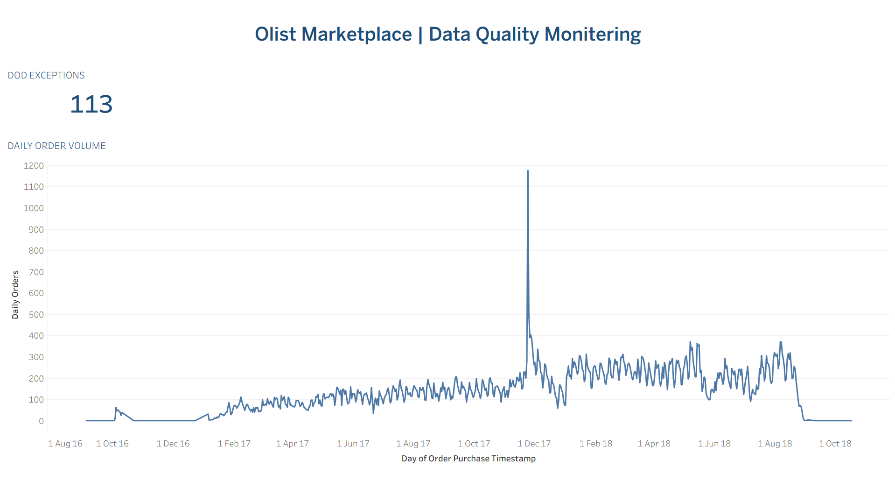

# Olist Marketplace Operations & Data Quality Intelligence

An end-to-end data analytics portfolio project using the **Olist
Brazilian E-commerce Public Dataset** to analyze marketplace operations,
customer behavior, seller performance, delivery performance, and data
quality.

The project combines **MS SQL Server, Python, and Tableau Public** to
transform raw marketplace data into business insights, structured
validation rules, exception monitoring, and interactive dashboards.

## Project Objectives

### Marketplace Operations

-   Analyze order and marketplace performance
-   Understand customer purchasing behavior
-   Evaluate seller performance
-   Analyze delivery performance
-   Understand delivery delays and customer reviews
-   Identify operational risk indicators

### Data Quality & Monitoring

-   Validate data completeness and consistency
-   Identify genuine data-quality exceptions
-   Investigate potential false positives
-   Monitor day-over-day order-volume changes
-   Tune monitoring rules to reduce unnecessary alerts
-   Classify exceptions for further investigation

## Dataset

The Olist order data contains **99,441 orders** with order status,
customer information, purchase and delivery timestamps, payment
information, product and seller information, and customer reviews.

## Tools & Technologies

  -----------------------------------------------------------------------
  Tool                                Usage
  ----------------------------------- -----------------------------------
  **MS SQL Server**                   Data validation, SQL analysis,
                                      exception monitoring

  **Python / Pandas**                 Data preparation and supporting
                                      analysis

  **Tableau Public**                  Interactive dashboards and
                                      monitoring visualization

  **Excel / CSV**                     Initial data exploration and
                                      dataset handling
  -----------------------------------------------------------------------

## Data Quality & Exception Monitoring

The SQL workflow validates: - Missing Order IDs - Duplicate Order IDs -
Missing Customer IDs - Missing Purchase Dates - Invalid Order Status
values - Payment values - Delivery-date consistency - Delivered orders
missing customer delivery timestamps

### False-Positive Investigation

The payment validation initially identified **3 zero-payment orders**.
Investigation showed that all 3 were associated with cancelled orders,
making them legitimate business scenarios.

**Result: 3 initial payment flags → 0 genuine payment exceptions**

### Delivery Data Quality

The validation identified: - **96,478 delivered orders** - **8 delivered
orders missing customer delivery timestamps**

These 8 records affect reliable calculation of delivery duration and
delivery variance.

## Day-over-Day Order Monitoring

An initial **20% change threshold** generated: - **231 exceptions** -
**36.49% exception rate**

Investigation showed that very small previous-day volumes could create
exaggerated percentage changes, such as:

**1 order → 32 orders = +3,100%**

### Final Monitoring Rule

The final rule requires: - **Absolute day-over-day change ≥ 30%** -
**Previous-day order volume ≥ 50**

### Final Results

  Metric                                    Result
  ---------------------------------- -------------
  Day-over-day comparisons checked         **633**
  Monitoring exceptions                    **113**
  Exception rate                        **17.85%**
  Increase exceptions                       **80**
  Decrease exceptions                       **33**
  High-volatility exceptions                 **5**
  Largest change                       **315.55%**

> **Important:** DoD exceptions are monitoring alerts requiring
> investigation. They are not automatically classified as data-quality
> errors.

### Example High-Volatility Exception

On **24 November 2017**:

-   Previous-day orders: **283**
-   Current-day orders: **1,176**
-   Change: **+315.55%**

The following day changed from **1,176 → 499 orders (-57.57%)**.

## Tableau Dashboards

### 1. Executive Overview

Key metrics: - **99,441 Total Orders** - **\$16,008,872 Total Payment
Value** - **\$160.99 Average Order Value** - **4.1 Average Review
Score**


### 2. Operations & Delivery Performance

Includes: - Fulfillment Funnel - Delivery by Region - Delay vs Review
Score


### 3. Customer, Seller & Investigation Intelligence

Includes: - Seller performance - Customer purchasing patterns -
Investigation indicators - Category risk versus revenue


### 4. Olist Data Quality Monitoring

Shows: - Daily order volume - Day-over-day monitoring exceptions



## Key Business Insights

-   The marketplace contains **99,441 orders**.
-   Total payment value is approximately **\$16 million**.
-   Average order value is approximately **\$160.99**.
-   Overall average review score is **4.1**.
-   The customer base is strongly concentrated around one-time
    purchases.
-   The validation workflow identified **8 genuine delivery-data
    exceptions**.
-   **3 initial payment-related false positives** were investigated and
    resolved through rule refinement.
-   **113 DoD monitoring alerts** were identified across **633
    comparisons** after tuning.
-   **5 high-volatility alerts** exceeded 100% change.

## Data Quality Investigation Framework

**Validation Rule → Exception Detection → Investigation → Business
Context → Rule Tuning / Action → Monitoring**

This helps distinguish: - Genuine data-quality problems - Legitimate
business scenarios - Monitoring alerts requiring further investigation

## SQL Analysis

The SQL analysis covers: - Order and operational analysis - Customer
analysis - Seller performance and risk - Product category intelligence -
Data quality and exception monitoring - Day-over-day monitoring and
threshold tuning

## Project Structure

``` text
Olist-Marketplace-Operations/
│
├── sql/
│   ├── 01_order_operational_analysis.sql
│   ├── 02_customer_analysis(3).sql
│   ├── 03_seller_performance_risk(3).sql
│   ├── 04_product_category_intelligence(3).sql
│   └── 05_data_quality_exception_analysis.sql
│
├── notebooks/
│   └── Data preparation and investigation notebooks
│
├── dashboard/
│   └── Olist_Dashboard.twbx
│
├── images/
│   ├── 01_Executive_Overview.png
│   ├── 02_Operations_&_DeliveryPerformance.png
│   ├── 03_Customer_Seller_Investigation.png
│   └── 04_Olist_DQ_Monitoring.png
│
└── README.md
```

## How to Explore

1.  Review the dashboard screenshots.
2.  Open the SQL files to understand the analysis.
3.  Open `sql/05_data_quality_exception_analysis.sql` for the complete
    validation and monitoring workflow.
4.  Open `dashboard/Olist_Dashboard.twbx` to explore the Tableau
    workbook.

## What This Project Demonstrates

-   Real-world relational e-commerce data analysis
-   Structured SQL analysis
-   Data completeness and consistency validation
-   Exception investigation
-   False-positive reduction
-   Day-over-day monitoring
-   Threshold tuning
-   Business-oriented Tableau visualization
-   Translation of technical analysis into business insights

## Author

**Gurram Harshitha**

Aspiring Data Analyst \| SQL \| Python \| Tableau \| Excel

Backend development background with a focus on data analytics, SQL
analysis, data quality, exception monitoring, visualization, and
business insights.
